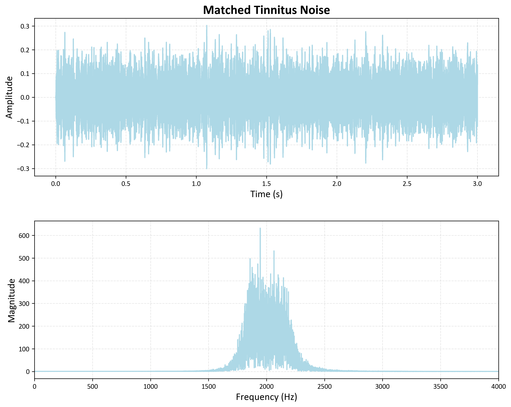

# tinnitus_noise_matching
Python script generates different noise to help users match the sound of their tinnitus. The script allows for interactive adjustment of the noise's centre frequency, bandwidth, and duration to match the user's tinnitus sound. It also includes functionality to play and save the matched noise.

  
